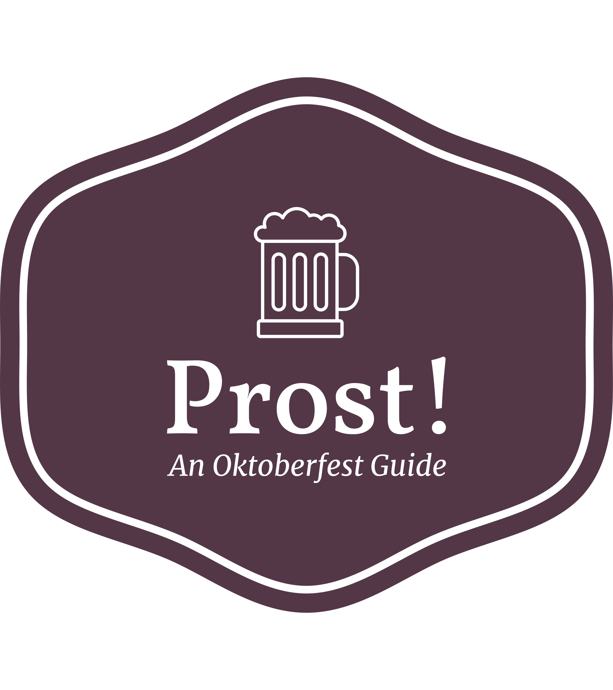

# Prost! An Oktoberfest Guide

Welcome to this Oktoberfest Guide! See all the large tents at Oktoberfest, details about the tents, and previous visits made. Login to add your own visit!

---

## Description

On page load the user will see the home page, with a picture of Oktoberfest and two navigation bars. The left one will allow the user to see an about page about Oktoberfest, all the big tents at Oktoberfest for this year 2023, and all visits already left on the site! The right navigation bar will allow you to sign in or sign up for this website. Once you are logged in, you will be able add visits, as well as edit or delete any previous visits you have already made!

Look around and enjoy this Oktoberfest Guide! PROST!

## Models

This project has some general static pages. Whether signed in or not the user can see the static homepage and about page.

This project includes three models. The user model includes an id, username, email and age. A user can sign in or sign up. A user must be 16 to sign up, as that is the legal age to drink beer in Germany. 

The tent model includes an id, name, capacity, first year the tent was at Oktoberfest, the name of Helles Oktoberfest beer sold at the tent, an image of the tent, a star image of the tent that shows where the tent is on the larger map of Oktoberfest, and details about the tent. Whether signed in or not, all tents can be seen as well as the additional detail page for each tent.

The visit model includes an id, visit rating, date, user id, and tent id. This model is the join table between tent and user. When someone is not signed in all visits can be seen. Once signed in, a user can create a visit. Additionally, while signed in a user can see all exisiting visits, but can only edit or delete their own visits.

----

## Getting Started

### Dependencies

- A modern web browser

### Installing 

- Open a terminal on your machine
- cd into where you want the project to be
- Git clone the repository:
    - `git clone https://github.com/amsfreeman/prost-an-oktoberfest-guide`
- Open vsCode by typing `code .`
- Open a terminal
- Make sure you are using `pyenv 3.8.13`
    - If not, type `pyenv 3.18.13` to use that version
- In this top directory:
    - Run `pipenv install`
- cd into the `client` side:
    - Run `npm install`
- cd back to the top directory:
    - Run `pipenv shell`
- Open another terminal and cd into `server` side:
    -   Run `python app.py`
- Return to the `client` side terminal:
    - Run `npm start`

---
## Authors

- Amelia Freeman (GitHub.com/amsfreeman)

---
## Acknowledgements

### Sources for Armbrustschützenzelt
- Source for Data Info: https://oktoberfest-guide.com/tents/armbrustschutzenzelt/
- Source for Tent Details: https://www.oktoberfest.de/en/beer-tents/big-tents/armbrustschuetzenzelt
- Image: https://www.armbrustschuetzenzelt.de/wp-content/uploads/2017/03/DSC_3621.jpg
### Sources for Augustiner-Festhalle 
- Source for Data Info: https://oktoberfest-guide.com/tents/augustiner-festhalle/
- Source for Tent Details: https://www.oktoberfest.de/en/beer-tents/big-tents/augustiner-festhalle
- Image: https://oktoberfest-guide.com/site/assets/files/2014/augustinerzelt-fassade-blauer-himmel.1920x0.webp
### Sources for Bräurosl
- Source for Data Info: https://oktoberfest-guide.com/tents/braurosl/
- Source for Tent Details: https://www.oktoberfest.de/en/beer-tents/big-tents/pschorr-braeurosl
- Image: https://oktoberfest-guide.com/site/assets/files/3161/braeurosl-fassade.1920x0.webp
### Sources for Fischer-Vroni
- Source for Data Info: https://oktoberfest-guide.com/tents/fischer-vroni/
- Source for Tent Details: https://www.oktoberfest.de/en/beer-tents/big-tents/fischer-vroni
- Image: https://www.oktoberfest.de/site/assets/files/2107/fischer_vroni_fassade_sebastian_lehner-06828.-landscape.jpg
### Sources for Hacker-Festzelt
- Source for Data Info: https://oktoberfest-guide.com/tents/hacker-festzelt/
- Source for Tent Details: https://www.oktoberfest.de/en/beer-tents/big-tents/hacker-festzelt
- Image: https://www.wiesnwirte.de/global/bilder/hacker-festzelt/hacker-festzelt.jpg?m=1543244914
### Sources for Hofbräu-Festzelt 
- Source for Data Info: https://oktoberfest-guide.com/tents/hofbrau-festzelt/
- Source for Tent Details: https://www.oktoberfest.de/en/beer-tents/big-tents/hofbraeu-festzelt
- Image: https://oktoberfest-guide.com/site/assets/files/2162/hofbrauzelt-fassade-frontal.1920x0.jpg
### Sources for Käfer Wiesnschänke
- Source for Data Info: https://oktoberfest-guide.com/tents/kafer-wiesn-schaenke/
- Source for Tent Details: https://www.oktoberfest.de/en/beer-tents/big-tents/kaefer-wiesn-schaenke
- Image: https://oktoberfest-guide.com/site/assets/files/2163/kafer-wiesn-strassenverkauf.1920x0.webp
### Sources for Löwenbräu-Festzelt
- Source for Data Info: https://oktoberfest-guide.com/tents/lowenbrau-festzelt/
- Source for Tent Details: https://www.oktoberfest.de/en/beer-tents/big-tents/loewenbraeu-festzelt
- Image: https://www.oktoberfest.de/site/assets/files/1477/loewenbraeu_fassade_sebastian_lehner-06928.jpg
### Sources for Marstall-Festzelt
- Source for Data Info: https://oktoberfest-guide.com/tents/marstall-festzelt/
- Source for Tent Details: https://www.oktoberfest.de/en/beer-tents/big-tents/marstall-festzelt
- Image: https://oktoberfest-guide.com/site/assets/files/2165/marstall-festzelt-fassade-seitlich.1920x0.webp
### Sources for Ochsenbraterei 
- Source for Data Info: https://oktoberfest-guide.com/tents/ochsenbraterei/
- Source for Tent Details: https://www.oktoberfest.de/en/beer-tents/big-tents/ochsenbraterei
- Image: https://oktoberfest-guide.com/site/assets/files/2142/ochsenbraterei-neubau-2017-front-tag.1920x0.webp
### Sources for Schottenhamel-Festhalle 
- Source for Data Info: https://oktoberfest-guide.com/tents/schottenhamel/
- Source for Tent Details: https://www.oktoberfest.de/en/beer-tents/big-tents/schottenhamel-festhalle
- Image: https://tischreservierung-oktoberfest.de/wp-content/uploads/2017/01 DSC_0425_Schottenhamel_au%C3%9Fen-2-1208x800.jpg
### Sources for Schützenfestzelt 
- Source for Data Info: https://oktoberfest-guide.com/tents/schutzenfestzelt/
- Source for Tent Details: https://www.oktoberfest.de/en/beer-tents/big-tents/schuetzen-festzelt
- Image: https://oktoberfest-guide.com/site/assets/files/2110/schutzenfestzelt-fassde-seitlich-bavaria-totale.1920x0.jpg
### Sources for Weinzelt 
- Source for Data Info: https://oktoberfest-guide.com/tents/weinzelt/
- Source for Tent Details: https://www.oktoberfest.de/en/beer-tents/big-tents/kufflers-wine-tent
- Image: https://www.oktoberfest.de/site/assets/files/1471/kufflers_weinzelt_fassade_sebastian_lehner-07421.-landscape.jpg
### Sources for Winzerer Fähndl (Paulaner Festzelt)
- Source for Data Info: https://oktoberfest-guide.com/tents/winzerer-fahndl-paulaner-festzelt/
- Source for Tent Details: https://www.oktoberfest.de/en/beer-tents/big-tents/paulaner-festzelt
- Image: https://paulanerfestzelt.de/wp-content/uploads/2019/11/paulaner-fest-tent.jpg

### Other Sources: 
- Credit for the favicon to: https://favicon.io/favicon-converter/
- Information about Tents: https://oktoberfest-guide.com/tents/
- Emoji for Edit and Delete Button: https://getemoji.com/

### People to Thank:
- My amazing instructors in the Flatiron Bootcamp, Adam and Emiley
- My study group, Jon and Jessica, I could not have made it to this point without you all
- Marc who helped me again and again
- My parents for their support during this bootcamp
- My whole amazing cohort, we're ever Walking Devs